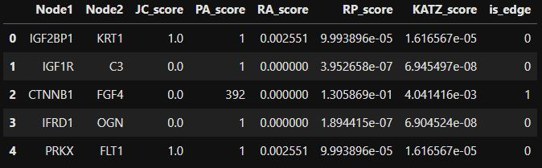

__________________________________________________________________________________________________________________________________________________
Author: Leila Fabiola Ferreira - 2022

# About the data
### The seed of Network - β-Catenin

β-Catenin is a multifunctional protein that plays an important role in the transduction of Wnt signals and in the intercellular adhesion by linking the cytoplasmic domain of cadherin.(From: Handbook of Immunohistochemistry and in Situ Hybridization of Human Carcinomas, 2006)

It is a cell adhesion molecule and transcriptional regulator implicated in cancer (Çelen İ, Ross KE, Arighi CN, Wu CH, 2015).

Bibliography: 

Çelen İ, Ross KE, Arighi CN, Wu CH (2015): Bioinformatics Knowledge Map for Analysis of Beta-Catenin Function in Cancer. PLoS ONE 10(10): e0141773. https://doi.org/10.1371/journal.pone.0141773). 

The biological analysis of the network can be founded in this paper: 
(https://journals.plos.org/plosone/article?id=10.1371/journal.pone.0141773).

The dataset used in this notebook can be founded in:
(https://journals.plos.org/plosone/article/file?type=supplementary&id=10.1371/journal.pone.0141773.s001)
__________________________________________________________________________________________________________________________________________________

# Network Analysis and Link Prediction

## Network Science
### APS

#### First we got the network features

• e.g. Nodes and edges quantity, Graph Density, Average Clustering, Node Conectivity;

• Nodes measures;

• Paths and diameter;

• Communities.

#### Link prediction strategy:

• Obtain a sample of existing links (edges);

• Obtain the same size sample of non-existent links (non_edges);

• Obtain the Jaccard Coefficient of the samples;

• Obtain the Preferential Attachment of the samples;

• Obtain the Resource Allocation Index of the samples;

• Obtain the Katz Matrix and Katz Scores of the samples (Reference: https://github.com/alphaWizard/link-prediction/blob/master/similarities.py);

• Obtain the Rooted Page Rank of the samples (Reference: https://github.com/alphaWizard/link-prediction/blob/master/similarities.py).

 After completing these steps, a dataframe was created with all the data obtained in the previous item to be used as a training set for the classification models. The parameters obtained are part of a set of functions for predicting links in the Networkx library and some functions of alphaWizard on Github (https://github.com/alphaWizard/link-prediction). Each index by itself can be used for link prediction in case of Networkx parameters (Jaccard Coefficient, Preferential Attachment and Resource Allocation Index), so the main idea is to combine these values in links labeled as non_edge = 0 and edge = 1 with balanced samples to evaluate the joint performance in a classification model.
Before training the models, the data were standardized using Sklearn's StandarScaler() method, since the data obtained were at different scales, as can be seen in the following figure:

 

 It is an important step because the models perform better with data in a standardized range, avoiding giving greater weight to data with larger scales. Standardization scales the data by subtracting the mean and dividing by the standard deviation, which results in a distribution with a standard deviation and a variance of 1.
Finally, five different models were trained and tested to classify links as edge (1) or non-edge (0).

#### The metrics analyzed were confusion matrix, accuracy and F1 score.

__________________________________________________________________________________________________________________________________________________
